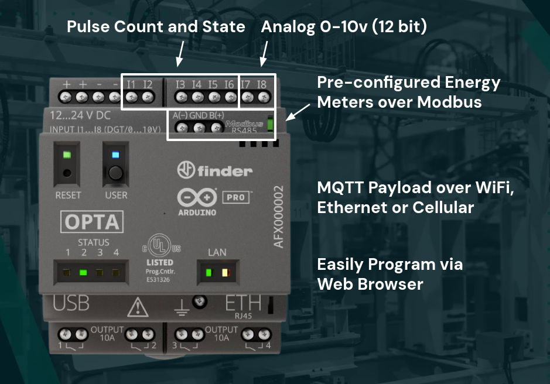
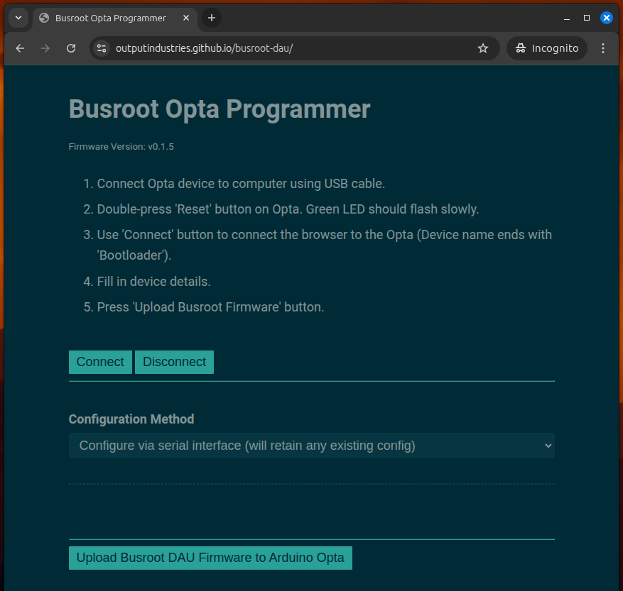
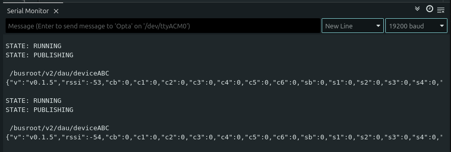

# Busroot DAU Firmware

Firmware to turn the Arduino Opta into a robust, easy-to-use, data aquisition unit (DAU) for industrial analytics. Featuring simple input handling, MQTT communication, and 1000-frame circular buffer for maximum reliability in the case of connection drops.

Supports communication over WiFi, Ethernet and the Blues Wireless for Opta (Cellular) device.

Firmware can be uploaded from a web browser using WebDFU: [https://outputindustries.github.io/busroot-dau/](https://outputindustries.github.io/busroot-dau/)

# Who is this for?

Anyone looking for a reliable and straightforward way to capture data points from a shop floor or industrial environment.



## Features

### Input Capabilities
- Support for pulse counting and state readings on inputs 1 to 6.
- Analog readings (12-bit, 0-4095 range) on inputs 7 and 8.
- Communication with Energy Meters over Modbus.

### Communication
- **MQTT** support over WiFi, Ethernet, or Blues Wireless for Opta
- **Modbus RTU** support for energy meters (19200 baud)
- **Serial console** for configuration and debugging
- JSON message format

### Reliability Features
- **1000-frame circular buffer** on M4 core (83 minutes @ 5s intervals)
- **Watchdog protection** on both cores
- **Lock-free circular buffer** for safe dual-core communication
- **Race-condition-free** counter implementation
- **Configuration persistence** in flash memory
- **Automatic MQTT reconnection** on connection failure

## Quick Start

1. Visit [https://outputindustries.github.io/busroot-dau/](https://outputindustries.github.io/busroot-dau/)
2. Chose to configure via the webpage, or configure via serial.
3. Double-tap reset button to enter bootloader mode.
4. Upload firmware.



## Project Structure

```
busroot-dau/
├── src/
│   ├── m4.cpp              # M4 core: Input reading
│   ├── m7.cpp              # M7 core: Networking & MQTT
│   ├── data_frame.h/cpp    # Inter-core communication
│   ├── config.h/cpp        # Configuration management
│   └── status.h/cpp        # Status & error handling
├── web/
│   ├── index.html          # Web interface
│   ├── css/styles.css      # Styling
│   ├── js/app.js           # JavaScript
│   └── firmwares/          # Auto-generated binaries
├── platformio.ini          # Build configuration
├── copy_firmware.py        # Post-build script
└── README.md               # This file
```


## MQTT Message Format



### Without Modbus
```json
{
  "ver": "v0.1.0",
  "rssi": -65, // WiFi Signal Strength (dB)
  "cb": 10,    // User Button Count
  "c1": 5,     // Input 1 Count
  "c2": 0,     // Input 2 Count
  "c3": 0,     // Input 3 Count
  "c4": 0,     // Input 4 Count
  "c5": 0,     // Input 5 Count
  "c6": 0,     // Input 6 Count
  "sb": 1,     // User Button State
  "s1": 0,     // Input 1 State
  "s2": 0,     // Input 2 State
  "s3": 0,     // Input 3 State
  "s4": 0,     // Input 4 State
  "s5": 0,     // Input 5 State
  "s6": 0,     // Input 6 State
  "a7": 12,    // Input 7 Analog
  "a8": 0      // Input 8 Analog
}
```

### With Modbus Energy Meter
```json
{
  "ver": "v0.1.0",
  "rssi": -65,
  "cb": 10,
  ...
  "p1v1": 230.5,  // Modbus Device 1 - Phase 1 Volts
  "p2v1": 231.2,  // Modbus Device 1 - Phase 2 Volts
  "p3v1": 229.8,  // Modbus Device 1 - Phase 3 Volts
  "p1a1": 5.4,    // Modbus Device 1 - Phase 1 Amps
  "p2a1": 4.9,    // Modbus Device 1 - Phase 2 Amps
  "p3a1": 5.1,    // Modbus Device 1 - Phase 3 Amps
  "pf1": 0.95,    // Modbus Device 1 - Power Factor
  "kWh1": 1234.5  // Modbus Device 1 - Kilowatt-hours (Meter Reading)
}
```

Published to: `{prefix}/busroot/v2/dau/{deviceId}`

## Configuration

Configuration is stored in flash memory and persists across reboots.

## Troubleshooting

### Device won't connect to WiFi
- Check SSID and password
- Verify 2.4GHz network (5GHz not supported)
- Check signal strength
- Try increasing WiFi retry attempts in code

### Messages not appearing in MQTT
- Verify broker address and port
- Check username/password
- Ensure topic permissions
- Monitor buffer status via serial

### Missing input pulses
- Check debounce delay (50ms default)
- Verify input wiring
- Monitor serial output
- Reduce send interval if needed

### Device resets unexpectedly
- Check watchdog timeout settings
- Verify power supply stability
- Monitor error codes on LEDs (D0-D3)

## Status LEDs

The device uses LEDs D0-D3 to show status codes in binary:

| Code | Meaning |
|------|---------|
| 1 | WiFi Connecting |
| 2 | Ethernet Connecting |
| 3 | MQTT Connecting |
| 4 | Running (normal) |
| 8 | MQTT Publishing |
| 9 | Config Load Error |
| 10 | WiFi Failed |
| 11 | MQTT Failed |
| 12 | Publish Failed |

RGB LED shows error state (red) or normal operation.

## Development

### Building
```bash
pio run                    # Build both cores
pio run -e opta_m7        # Build M7 only
pio run -e opta_m4        # Build M4 only
```

### Uploading
```bash
pio run -e opta_m7 -t upload
pio run -e opta_m4 -t upload
```

### Monitoring
```bash
pio device monitor -b 19200
```

### Clean Build
```bash
pio run -t clean
pio run
```

## Technical Specifications

- **Version**: 5
- **Platform**: STM32H747XIH6 (480MHz dual-core)
- **Framework**: Arduino (Mbed OS)
- **Send Interval**: 5 seconds (configurable)
- **Debounce Delay**: 50ms (configurable)
- **Buffer Capacity**: 1000 frames (83 minutes @ 5s intervals)
- **Serial Baud**: 19200
- **Modbus Baud**: 19200 (8N1)

## Attributions

* WebDFU - https://github.com/devanlai/webdfu