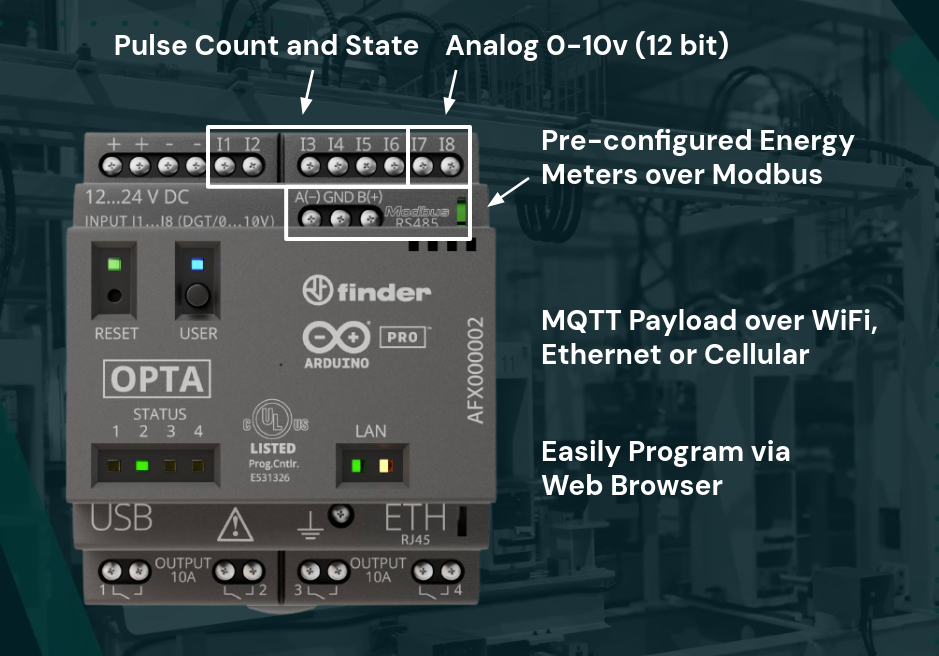
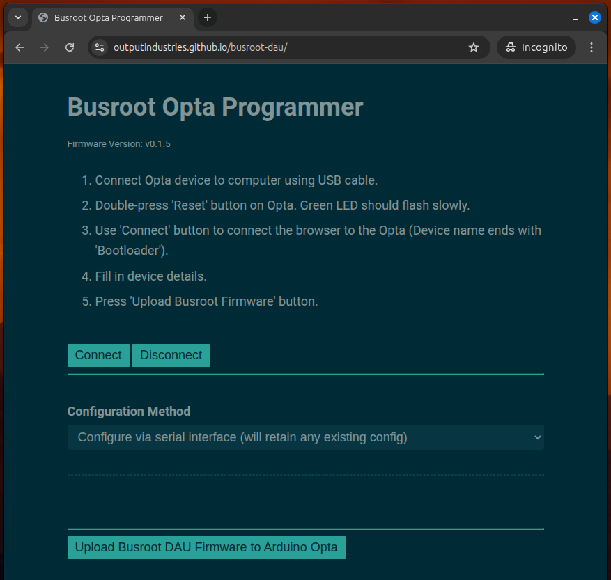
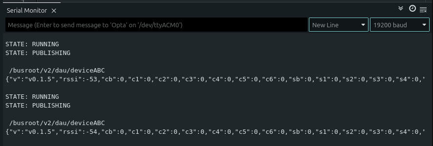

# Busroot DAU Firmware

Firmware to turn the [Arduino Opta](https://docs.arduino.cc/hardware/opta/) into a robust, easy-to-use, data acquisition unit (DAU) for industrial analytics. It collects inputs from its terminals — pulse counts, digital states, analog readings, and Modbus meters — and transmits them to an MQTT broker over WiFi or Ethernet, with a 1000-frame circular buffer for maximum reliability in the case of connection drops.

A single generic binary runs on every device. Per-device settings (IDs, credentials, Modbus register addresses) are applied through configuration rather than separate builds, so the same firmware image is reused across a fleet.

Firmware can be uploaded from a web browser using WebDFU: [https://outputindustries.github.io/busroot-dau/](https://outputindustries.github.io/busroot-dau/)

# Who is this for?

Anyone looking for a reliable and straightforward way to capture data points from a shop floor or industrial environment.



## Features

### Input Capabilities
- Support for pulse counting and state readings on inputs 1 to 6.
- Analog readings (12-bit, 0-4095 range) on inputs 7 and 8.
- Communication with Energy Meters over Modbus.

### Communication
- **MQTT** support over WiFi or Ethernet
- **Modbus RTU** support for energy meters (19200 baud)
- **Serial console** for configuration and debugging
- JSON message format

### Reliability Features
- **1000-frame circular buffer** on M4 core (83 minutes @ 5s intervals)
- **Watchdog protection** on the M7 core (sole watchdog owner, so a hung M7 always resets the device)
- **Publish dead-man timer**: the device restarts if no message has been successfully sent for 2 minutes
- **Hard-fail recovery**: failed WiFi scans and Ethernet DHCP attempts trigger a restart instead of hanging
- **Lock-free circular buffer** for safe dual-core communication
- **Race-condition-free** counter implementation
- **Configuration persistence** in flash memory
- **Automatic MQTT reconnection** on connection failure

## Quick Start

1. Visit [https://outputindustries.github.io/busroot-dau/](https://outputindustries.github.io/busroot-dau/)
2. Choose to configure via the webpage, or configure via serial.
3. Double-tap reset button to enter bootloader mode.
4. Upload firmware.



## Inputs

| Input | Pin | Capability |
|-------|-----|------------|
| 1–6 | `A0`–`A5` | **Pulse counting** (falling edges, 50 ms debounce) and **digital state snapshot** |
| 7 | `A6` | **Analog reading** (12-bit, 0–4095) |
| 8 | `A7` | **Analog reading** (12-bit, 0–4095) |
| User button | `BTN_USER` | Pulse-counted and snapshotted, like inputs 1–6 |

Inputs 7 and 8 are analog-only — they do not pulse-count. Inputs 1–6 do not read analog.

In addition, the device can act as a **Modbus RTU master over RS485** to read external meters: per-phase voltage and current, power factor, and kWh, each at a configurable register address. See [MQTT Message Format](#mqtt-message-format) for the two supported register-decode styles.

## How it works — dual-core operation

The Opta's microcontroller has two cores, and the firmware splits work across them:

- **M7 core — communication.** WiFi/Ethernet, the MQTT client, the Modbus RTU master, configuration & flash storage, and publishing.
- **M4 core — input reading.** Continuously samples the input pins, debounces them, and counts edges.

Dedicating the M4 core to input sampling means no pulses are missed while the M7 core is busy with networking.

The two cores share data through a **circular buffer in SDRAM** (1000-frame capacity). The M4 core writes a data frame every **5 seconds**; the M7 core consumes frames and publishes them. The buffer lets readings survive temporary network outages — roughly 83 minutes of data at one frame every 5 seconds — and is drained in order once connectivity returns.

At startup the M7 core boots the M4 core (`bootM4()`). A hardware **watchdog** runs on the M7 core only — both cores' watchdogs map to the same hardware timer, so keeping the M7 core as its sole owner guarantees an M7 stall resets the device. An M4 failure is caught instead by the M7 core's **publish dead-man timer**: no frames from M4 means no successful publishes, which forces a restart after 2 minutes.

## MQTT Message Format

Each frame is published as a JSON message to:

```
busroot/v1/dau/{deviceId}
```

An optional `mqttTopicPrefix` is prepended when set (`{prefix}/busroot/v1/dau/{deviceId}`).



### Without Modbus
```json
{
  "v": "260630", // Firmware version
  "rssi": -65,   // WiFi Signal Strength (dB)
  "up": 3600,    // Uptime (seconds)
  "cb": 10,      // User Button Count
  "c1": 5,       // Input 1 Count
  "c2": 0,       // Input 2 Count
  "c3": 0,       // Input 3 Count
  "c4": 0,       // Input 4 Count
  "c5": 0,       // Input 5 Count
  "c6": 0,       // Input 6 Count
  "sb": 1,       // User Button State
  "s1": 0,       // Input 1 State
  "s2": 0,       // Input 2 State
  "s3": 0,       // Input 3 State
  "s4": 0,       // Input 4 State
  "s5": 0,       // Input 5 State
  "s6": 0,       // Input 6 State
  "a7": 12,      // Input 7 Analog
  "a8": 0        // Input 8 Analog
}
```

### With Modbus Energy Meter
```json
{
  "v": "260630",
  "rssi": -65,
  "up": 3600,
  "cb": 10,
  ...
  "p1v1": 230.5,  // Modbus Device 1 - Phase 1 Volts
  "p2v1": 231.2,  // Modbus Device 1 - Phase 2 Volts
  "p3v1": 229.8,  // Modbus Device 1 - Phase 3 Volts
  "p1a1": 5.4,    // Modbus Device 1 - Phase 1 Amps
  "p2a1": 4.9,    // Modbus Device 1 - Phase 2 Amps
  "p3a1": 5.1,    // Modbus Device 1 - Phase 3 Amps
  "pf1": 0.95,    // Modbus Device 1 - Power Factor
  "kWh1": 1234.5  // Modbus Device 1 - Kilowatt-hours (Meter Reading)
}
```

**Modbus register-decode styles** (`modbusRegisterStyle`): each value is read as two 16-bit input registers and decoded as a 32-bit value:

- `0` — 32-bit IEEE-754 float, most-significant word first (e.g. RS-Pro meters).
- `1` — 32-bit integer, word-swapped (least-significant word first; e.g. Carlo Gavazzi meters).

## Configuration

Configuration can be applied from the [web programmer](https://outputindustries.github.io/busroot-dau/) or **over serial**, and is persisted to **flash** — which is what lets one generic binary serve every device. On boot the device presents a serial config editor (press <kbd>Enter</kbd> within the prompt window) that walks through the communication mode, device ID, WiFi credentials, MQTT connection, Modbus settings, and the Modbus register addresses. Entering a single space resets a field to its compiled-in default.

- `communicationMode` is `WIFI`, `ETHERNET`, or `NONE`. `NONE` runs the device in serial-only mode with no network. A failed config load also drops the device into serial-only mode.
- `deviceId` is used as-is when set; if left blank the device falls back to using its **MAC address** as the ID.

Configuration can also be baked in at compile time with `-DSKIP_FLASH_CONFIG`, which skips flash storage and the serial editor entirely.

## Firmware version

`FIRMWARE_VERSION` is injected at build time from the environment (see `platformio.ini` and the GitHub workflows — releases use the git tag, dev builds use `dev-<sha>`) and is included in every MQTT message as the `v` field. For local builds, set it yourself: `FIRMWARE_VERSION=dev-local pio run`.

## LED Status System

Three indicators report device status: an **RGB status LED** (one physical light, driven by the red and green channels together), a separate **blue LED**, and the 4 numbered LEDs D0-D3 that show the state code in binary.

### RGB status LED (red / green / amber)

The red and green channels share one physical LED, so it shows one of three colours:

| Colour | Meaning |
|--------|---------|
| **Amber** (red + green) | Booting / connecting — WiFi, Ethernet, or MQTT connection in progress (states 1-3) |
| **Green** | Running normally — connected and in the main loop (states 4-8) |
| **Red** | Fatal error — held for 5 seconds while D0-D3 show the error code, then the device restarts |

### Blue LED

The blue LED is a separate indicator with two sources:

- **Publish flash (M7 core):** it turns on while a data frame is being read from the buffer and published to MQTT, then turns off. Since the M4 core produces a frame every 5 seconds, a healthy device blips blue roughly every 5 seconds.
- **User button (M4 core):** it also lights while the user button is held down.

**A healthy device therefore shows a solid green RGB LED with a blue LED that flashes periodically** — green confirms the network and MQTT connections are up, and the periodic blue flash confirms data is actually being transmitted. A green LED with no blue flashing means the device is connected but not publishing frames.

### State LEDs (D0-D3)

Device state is displayed on 4 LEDs (D0-D3) in binary. LEDs are physically labelled 1-4 left to right, mapping to LED_D0-LED_D3.

The bit mapping in code is:
- LED_D0 (label 1) = bit 3 (0x08)
- LED_D1 (label 2) = bit 2 (0x04)
- LED_D2 (label 3) = bit 1 (0x02)
- LED_D3 (label 4) = bit 0 (0x01)

### State Codes

| Code | Binary (D0-D3) | Name | Description |
|------|-----------------|------|-------------|
| 1 | 0001 | STATE_WIFI_CONNECTING | Connecting to WiFi |
| 2 | 0010 | STATE_ETHERNET_CONNECTING | Connecting to Ethernet |
| 3 | 0011 | STATE_MQTT_CONNECTING | Connecting to MQTT broker |
| 4 | 0100 | STATE_RUNNING | Normal operation |
| 5 | 0101 | STATE_READING_M4 | Reading data from M4 core |
| 7 | 0111 | STATE_READING_MODBUS | Reading Modbus devices |
| 8 | 1000 | STATE_PUBLISHING | Publishing MQTT message |

### Error Codes (9-15)

Errors also turn the RGB LED red and trigger a restart after 5 seconds.

| Code | Binary (D0-D3) | Name | Description |
|------|-----------------|------|-------------|
| 9 | 1001 | ERROR_CONFIG_LOAD | Config load/decode failed |
| 10 | 1010 | ERROR_WIFI_FAILED | WiFi connection failed |
| 11 | 1011 | ERROR_MQTT_FAILED | MQTT connection failed |
| 12 | 1100 | ERROR_PUBLISH_FAILED | MQTT publish failed |
| 13 | 1101 | ERROR_ETHERNET_FAILED | Ethernet connection failed |
| 14 | 1110 | ERROR_BUFFER_OVERFLOW | Data frame buffer overflow |
| 15 | 1111 | ERROR_UNKNOWN | Catch-all error |

The status system is defined in `src/status.h` and `src/status.cpp`. Code 6 is intentionally unused (it was retired with an earlier protobuf/RPC inter-core transport); the cores now exchange data via the SDRAM circular buffer described above.

## Project Structure

```
busroot-dau/
├── src/
│   ├── m4.cpp              # M4 core: Input reading
│   ├── m7.cpp              # M7 core: Networking & MQTT
│   ├── data_frame.h/cpp    # Inter-core communication
│   ├── config.h/cpp        # Configuration management
│   └── status.h/cpp        # Status & error handling
├── web/                    # WebDFU browser programmer (Vite/TypeScript)
├── platformio.ini          # Build configuration
└── README.md               # This file
```

## Development

### Building
```bash
FIRMWARE_VERSION=dev-local pio run   # Build both cores
pio run -e opta_m7                   # Build M7 only
pio run -e opta_m4                   # Build M4 only
```

### Uploading
```bash
pio run -e opta_m7 -t upload
pio run -e opta_m4 -t upload
```

### Monitoring
```bash
pio device monitor -b 19200
```

### Clean Build
```bash
pio run -t clean
```

## Troubleshooting

### Device won't connect to WiFi
- Check SSID and password
- Verify 2.4GHz network (5GHz not supported)
- Check signal strength

### Messages not appearing in MQTT
- Verify broker address and port
- Check username/password
- Ensure topic permissions
- Monitor buffer status via serial

### Missing input pulses
- Check debounce delay (50ms default)
- Verify input wiring
- Monitor serial output
- Reduce send interval if needed

### Device resets unexpectedly
- Monitor error codes on LEDs (D0-D3)
- A restart every ~2 minutes with no blue publish flash means the publish dead-man timer is firing — check connectivity and broker reachability
- Verify power supply stability

## Technical Specifications

- **Platform**: STM32H747XIH6 (480MHz dual-core)
- **Framework**: Arduino (Mbed OS)
- **Send Interval**: 5 seconds (configurable)
- **Debounce Delay**: 50ms (configurable)
- **Buffer Capacity**: 1000 frames (83 minutes @ 5s intervals)
- **Serial Baud**: 19200
- **Modbus Baud**: 19200 (8N1)

## Attributions

* WebDFU - https://github.com/devanlai/webdfu
